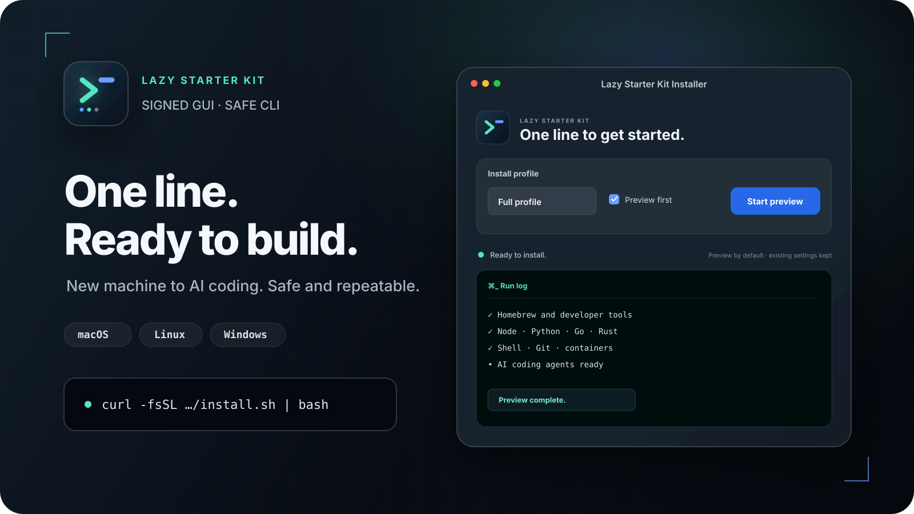

<div align="center">

[English](./README.md) · [简体中文](./README.zh-CN.md) · **日本語** · [한국어](./README.ko.md)



*このイラストは旧リリースの full プロファイルのプレビュー画面です。現在の推奨セットアップを実際にインストール・検証した結果ではありません。下の[現在の推奨セットアップ](#recommended-setup)に沿って進めてください。*

### マシンが違っても、スタートラインはひとつ。

自分のマシンで AI コーディングを始める、いちばん手早い方法です。

[](https://github.com/Heoooooon/lazy-starter-kit/actions/workflows/ci.yml)
[](https://github.com/Heoooooon/lazy-starter-kit/releases)
[](./LICENSE)
[](#)

[推奨セットアップ](#recommended-setup) · [最初のプロジェクト](#first-project) · [変更履歴](./CHANGELOG.md)

</div>

<a id="quick-start"></a>

## クイックスタート

**プロファイルが分からなければ、既定値（`ai`）のままで大丈夫です。** 下のコマンドはすでに `ai` を使います。ほかのプロファイルは[高度なオプション](#advanced-options)にあります。

**1. まずプレビュー**（v0.15.2 のソースを取得し、インストール計画だけを表示します。何もインストールしません）:

macOS:

```bash
git clone --branch v0.15.2 --single-branch https://github.com/Heoooooon/lazy-starter-kit.git lazy-starter-kit-v0.15.2 && cd lazy-starter-kit-v0.15.2 && bash ./install.sh --profile ai --dry-run
```

Linux:

```bash
git clone --branch v0.15.2 --single-branch https://github.com/Heoooooon/lazy-starter-kit.git lazy-starter-kit-v0.15.2 && cd lazy-starter-kit-v0.15.2 && bash ./linux/install.sh --profile ai --dry-run
```

Windows (PowerShell):

```powershell
git clone --branch v0.15.2 --single-branch https://github.com/Heoooooon/lazy-starter-kit.git lazy-starter-kit-v0.15.2; cd lazy-starter-kit-v0.15.2; powershell.exe -NoProfile -ExecutionPolicy Bypass -File .\windows\install.ps1 -Profile ai -DryRun
```

**2. インストール**（同じターミナル・同じフォルダで、自分の OS の 1 行だけを実行）:

macOS:

```bash
bash ./install.sh --profile ai
```

Linux:

```bash
bash ./linux/install.sh --profile ai
```

Windows (PowerShell):

```powershell
powershell.exe -NoProfile -ExecutionPolicy Bypass -File .\windows\install.ps1 -Profile ai
```

macOS で GUI を使いたい場合や、先にスクリプトを読みたい場合は[推奨セットアップ](#recommended-setup)を参照してください。

---

## これは何？

新しいノート PC やデスクトップを用意すると、Git、ランタイム、ターミナルツール、
Docker、AI コーディングエージェントをひとつずつ入れていくことになりがちです。

lazy-starter-kit は、その開発環境を一度にまとめて立ち上げ、あとから結果を
確認する手段も用意します。

v0.15.2 のデフォルトである `ai` プロファイルは、**Git、Node.js LTS/npm、Claude Code、
Codex、安全フック、最小限の PATH 設定**と、それらのインストールに必要な前提ツールを
準備します。Python、Go、Rust、Docker、Bun、uv、シェルの見た目まわりの設定、フォント、
オプションの CLI バンドルは含みません。

**まずは v0.15.2 から：** 小さな AI セットアップとガイド付きの初回起動を使うには、
下の[リリースのダウンロードまたはバージョン固定のソースコマンド](#recommended-setup)を
使ってください。v0.13.0 にも `recommended` 開発者プロファイルと初回利用ガイドはありましたが、
`ai` デフォルトと新しい GUI フローはありません。

明示的に指定する `recommended` プロファイルは、従来どおり幅広い開発者向けバンドルを入れます。

- CLI: git, gh, jq, ripgrep, fd, fzf, bat, tree, ast-grep, zoxide
- ランタイム: Node.js, Python, Go, Rust
- シェル/プロンプト: macOS/Linux では zsh と oh-my-zsh、Windows では PowerShell、starship、Nerd Font
- AI エージェント: Claude Code (`claude`) と Codex (`codex`)

Docker は含まれず、Windows の WSL も含まれません。Hermes は macOS/Linux 向けの上級者用
オプトインで、たとえば内容を確認したソースのチェックアウトから
`HERMES=1 ./install.sh --profile recommended` のように実行します（Linux では `./linux/install.sh` を使います）。`ai` は、
環境変数として引き継いだ `HERMES=1` もあえて無視します。Windows ネイティブの Hermes インストーラーはありません。
現在のキットは、gajae-code (`gjc`) や lazycodex のような提供終了したエージェントを
インストールも削除もせず、既存の設定にも手を付けません。

すでに入っているツールは、可能な範囲でそのままにします。管理対象の設定ファイルを
編集するのは、はっきりマークされたブロックの中だけです。現在の状態を確認するには `--doctor`、
変更を適用する前にプレビューするには `--dry-run` を使ってください。

---

<a id="ai-setup"></a>

## AI セットアップ (v0.15.2)

プロファイルやステップを個別に指定しない通常の GUI / CLI インストールは、現在 `ai` を
使います。明示的に指定した `recommended`、`full`、`minimal`、`work` の内容は従来のままです。
**`recommended` は `ai` の別名ではありません。** 引き続き、Docker と Windows WSL を除いた
幅広い開発者向けバンドルをインストールします。

| OS | `ai` での Node.js LTS |
|---|---|
| macOS | Homebrew `node@24`（npm を含む） |
| Linux | mise `node@lts`（npm を含む） |
| Windows | winget `OpenJS.NodeJS.LTS`（npm を含む） |

**なぜ Node.js と npm が必要なの？** Codex は npm でインストールし、安全フックの
インストーラーと AI ツールの安全フックは Node.js で動きます。始めるにあたって実行ツールを
自分で選ぶ必要はありません。下にある、お使いの OS 向けの手順に沿って進めてください。

<details>
<summary>ツール用語の説明: Node.js, npm, Bun, bunx, mise</summary>

| 名前 | 役割 |
|---|---|
| Node.js | JavaScript で書かれたプログラムを実行します。 |
| npm | 通常は Node.js に同梱されていて、プロジェクトのパッケージや CLI ツールをダウンロードします。 |
| Bun | パッケージをインストールし、JavaScript や TypeScript のプログラムを実行します。 |
| bunx | Bun に同梱されています。CLI ツールを探して実行し、必要ならダウンロードもします。 |
| mise | Node.js や Bun などの開発ツールをインストールし、使うバージョンを切り替えます。 |

**インストールと実行は別物です。** npm で入れるパッケージの多くは Bun でもインストール
できますが、追加のインストール設定が必要なものや、実行に Node.js が必要なものもあります。
Bun でインストールできたからといって、Node.js なしで動くとは限りません。

**ここで説明しているからといって、キットに含まれるとは限りません。** 現在のデフォルトの
`ai` プロファイルは Bun/bunx をインストールしません。Linux では Node.js のインストールに
mise を使いますが、macOS と Windows のデフォルトの `ai` プロファイルは mise を入れません。
上級者向けプロファイルは対象範囲が異なるので、インストール前にプレビューで確認してください。

詳しくはこちら: [Bun のパッケージインストール](https://bun.com/docs/pm/cli/install)、
[bunx での実行](https://bun.com/docs/pm/bunx)、
[mise のバージョン選択](https://mise.jdx.dev/getting-started.html)。

</details>

**インストールの前に：** ダウンロードと AI サービスの利用にはインターネット接続が必要です。
Claude Code には、サービスを利用できる Claude アカウントか、対応する API 認証情報が必要です。
Codex には、サービスを利用できる ChatGPT アカウントか、対応する API 認証情報が必要です。
インストールにはサブスクリプション、サービスの利用権、クレジットは含まれません。各プロバイダーの
規約や料金、所属組織のポリシーを先に確認してください。新しい GUI は、インストール前に
これらの要件を表示します。

v0.15.2 の GUI では、**Install** がメインのアクションです。**Preview** は別のアクションで、
何も変更しません。プレビューが完了しただけ、あるいはインストーラーが正常終了しただけでは、
マシンの準備ができたことにはなりません。Git、Node、npm、Claude Code、Codex が実際に動き、
バージョンチェックを通る必要があります。実行ファイルが見つからない、またはチェックに失敗した
場合は **ready** ではなく **action needed** です。ローカルの準備状況チェックでは、
認証やプロバイダーとの実際のセッションまではテストしません。

まっさらな Mac では、Xcode Command Line Tools や Homebrew の前提ツールについての案内に
従ってください。インストールがターミナルで続く場合は、そこで最後まで終わらせてから GUI の
結果チェックに戻り、それから練習セッションを始めます。インストールされた PATH を確認するときは、
インストール前のシェルではなく、新しく開いたターミナルウィンドウを使ってください。

CLI でインストールする場合は、[下](#recommended-setup)のコマンドで **v0.15.2 のソース**を
取得し、インストーラーとスクリプトの中身を確認してから、そのソースのルートで
自分の OS の行のコマンドだけを使ってください。

| OS | プレビュー | インストール | 新しいターミナルで確認 |
|---|---|---|---|
| macOS | `bash ./install.sh --profile ai --dry-run` | `bash ./install.sh --profile ai` | `bash ./install.sh --profile ai --doctor` |
| Linux | `bash ./linux/install.sh --profile ai --dry-run` | `bash ./linux/install.sh --profile ai` | `bash ./linux/install.sh --profile ai --doctor` |
| Windows | `powershell.exe -NoProfile -ExecutionPolicy Bypass -File .\windows\install.ps1 -Profile ai -DryRun` | `powershell.exe -NoProfile -ExecutionPolicy Bypass -File .\windows\install.ps1 -Profile ai` | `powershell.exe -NoProfile -ExecutionPolicy Bypass -File .\windows\install.ps1 -Profile ai -Doctor` |

必要なツールが足りない場合は、そのログを確認して報告された問題を解決し、同じ `ai`
プロファイルでもう一度実行してください。`--only` / `-Only` による個別指定や、プロファイルなしの
`--skip` / `-Skip` 指定では、幅広い開発者向けステップの内容がそのまま使われます。
AI セットアップを小さく直すための近道としては使わないでください。未知のプロファイルや
ステップ ID は、有効な名前の一覧とともに拒否されます。プロファイルと `--only` / `-Only` は
併用できません。

チェックが通ったら、Claude Code か Codex を選び、GUI から **新しい空の練習用フォルダー**を
明示的に開いて起動します。プロンプトのコピーは、最初のリクエスト文をクリップボードに入れるだけで、
送信はしません。サインインし、プロンプトを確認してから、自分で送信してください。自動アンインストールや
削除のための UI はありません。手動で同じことをする方法は[最初のプロジェクト](#first-project)にあります。

---

<a id="recommended-setup"></a>

## 推奨セットアップ (v0.15.2)

**はじめての方は、macOS なら下の v0.15.2 GUI を使ってください。Windows GUI は実験的なものです。**
デフォルトの `ai` プロファイルは、Docker や Windows WSL なしで Claude Code と Codex を
セットアップします。v0.15.2 は gajae-code (`gjc`)、lazycodex、およびその既存設定を
インストールも削除もしません。自動アンインストール機能もありません。

<a id="gui-downloads"></a>

### GUI のダウンロード

| OS | v0.15.2 GUI アセット | 展開後に開くもの |
|---|---|---|
| macOS 14 以降、Apple Silicon または Intel | [lazy-starter-kit-macos-gui.zip](https://github.com/Heoooooon/lazy-starter-kit/releases/download/v0.15.2/lazy-starter-kit-macos-gui.zip) | `Lazy Starter Kit Installer.app` |
| Windows（実験的） | [lazy-starter-kit-windows-gui.zip](https://github.com/Heoooooon/lazy-starter-kit/releases/download/v0.15.2/lazy-starter-kit-windows-gui.zip) | `Lazy-Starter-Kit-Installer.cmd` |
| Linux | GUI パッケージなし | 下の v0.15.2 ソースコマンドか [Linux ガイド](linux/README.md)を使ってください |

**Windows 版は実験的です：** 自動テストとインストールパッケージの検証は通っています。
ただし、実機の Windows PC での手動検証は、ランチャーのダブルクリックからインストーラー画面、
権限の確認ダイアログ、インストール完了、初回起動までの一連の流れをすべてカバーしてはいません。

GUI は **ai** で起動し、**Install** がメインのアクション、**Preview** が別ボタンになっています。
まずインストールせずにプランを確認し、準備ができたら Install を選んでください。プロファイルや
ステップを指定しない通常の CLI インストールも `ai` を使います。AI プランには `docker` と
Windows の `wsl` は含まれません。プレビューのみ、インストールの失敗やキャンセル、準備状況チェックが
完了していない状態では、初回起動の操作は有効になりません。インストールとチェックが成功したら、
[新しいターミナル、バージョン確認、最初のプロジェクト](#first-project)に進んでください。
アカウントへのサインインと最初のプロンプトは手動のままです。

変更点とすべてのアセットは [v0.15.2 のリリースページ](https://github.com/Heoooooon/lazy-starter-kit/releases/tag/v0.15.2)を
参照してください。パッケージ化された GUI は、それぞれのリリースコミットに固定されています。
標準のリモートブートストラップは、デフォルトで公開済みの最新 GitHub Release を使います。
`main` への変更でリリースの ZIP が自動的に更新されることはありません。

**v0.13.0** では、プロファイルなしの CLI インストールは full、GUI は recommended + プレビューでした。
明示的な開発者プロファイルとアンインストールしない方針は v0.15.2 にも引き継がれていますが、
v0.13.0 の ZIP に新しい AI フローは入りません。

さらに古い **v0.12.0** には `recommended` プロファイルがなく、GUI は full + プレビューで起動します。
gajae-code と lazycodex をインストールし、旧来の自動アンインストールの挙動も残っています。
ここで説明しているセットアップには使わないでください。

### ソースからインストール（Linux またはターミナル派の方）

下のコマンドは **v0.15.2 タグ**をクローンし、ローカルのインストーラーを実行します。
先に [Git](https://git-scm.com/downloads) をインストールして新しいターミナルを開くか、
[v0.15.2 のソース ZIP](https://github.com/Heoooooon/lazy-starter-kit/archive/refs/tags/v0.15.2.zip) をダウンロードして
展開し、`lazy-starter-kit-0.15.2` でターミナルを開いてください。ZIP の場合は、
clone と `cd` のコマンドは飛ばします。既存のチェックアウトではなく、新しいフォルダーを使ってください。

### 1. 中身を確認してプレビューする

実行する前に、インストーラーとその `scripts/` フォルダーをエディターで開いて確認してください。
プレビューは、選ばれたステップをインストールせずに表示します。プランに `docker` と、
Windows では `wsl` が含まれていないことを確認してください。

### macOS

```bash
git clone --branch v0.15.2 --single-branch https://github.com/Heoooooon/lazy-starter-kit.git lazy-starter-kit-v0.15.2
cd lazy-starter-kit-v0.15.2
# Inspect install.sh and scripts/, then preview:
bash ./install.sh --profile ai --dry-run
```

### Linux

Ubuntu/Debian、Fedora/RHEL、Arch、openSUSE 系に対応しています。

```bash
git clone --branch v0.15.2 --single-branch https://github.com/Heoooooon/lazy-starter-kit.git lazy-starter-kit-v0.15.2
cd lazy-starter-kit-v0.15.2
# Inspect linux/install.sh and linux/scripts/, then preview:
bash ./linux/install.sh --profile ai --dry-run
```

プラットフォームごとの詳細: [Linux ガイド](linux/README.md)。

### Windows

PowerShell（5.1 以降）で実行します。

```powershell
git clone --branch v0.15.2 --single-branch https://github.com/Heoooooon/lazy-starter-kit.git lazy-starter-kit-v0.15.2
cd lazy-starter-kit-v0.15.2
# Inspect windows/install.ps1 and windows/scripts/, then preview:
powershell.exe -NoProfile -ExecutionPolicy Bypass -File .\windows\install.ps1 -Profile ai -DryRun
```

`-ExecutionPolicy Bypass` が効くのはこの子プロセスだけで、保存されている PowerShell の
ポリシーは変わりません。会社のポリシーで実行がブロックされることはあります。IT 部門の制限を
回避するためにポリシーを変更しないでください。プラットフォームごとの詳細: [Windows ガイド](windows/README.md)。

### 2. 確認したプランを適用する

同じソースフォルダーのまま、**自分の OS のコマンドだけ**を実行します。

| OS | 適用 |
|---|---|
| macOS | `bash ./install.sh --profile ai` |
| Linux | `bash ./linux/install.sh --profile ai` |
| Windows | `powershell.exe -NoProfile -ExecutionPolicy Bypass -File .\windows\install.ps1 -Profile ai` |

システムの確認ダイアログは、内容を確認してから承認してください。macOS では Xcode Command Line Tools
と Homebrew のセットアップが必要になる場合があります。前提ツールの案内に従い、求められたら同じ
コマンドをもう一度実行してください。警告やスキップされたステップも確認しましょう。
インストーラーが正常終了しても、すべてのツールがインストール済み・サインイン済みであるとは限りません。
続きは[新しいターミナルと最初のプロジェクト](#first-project)へ。

---

<a id="advanced-options"></a>
<a id="common-options"></a>

## 高度なオプション（ほかのプロファイル）

**高度:** 既定値の `ai` のままなら、このセクションは読み飛ばしてかまいません。

以下の明示的な開発者プロファイル向けオプションは、v0.15.2 でも引き続き使えます。
ソースのルートで実行してください（Linux では `./install.sh` を
`./linux/install.sh` に置き換えます）。

```bash
./install.sh --profile recommended --dry-run
./install.sh --profile recommended --doctor
./install.sh --update --profile recommended
./install.sh --only agents
./install.sh --skip docker
./install.sh --profile minimal
./install.sh --profile work
```

Windows では `windows\install.ps1` を使い、`--dry-run` や `--only` の代わりに `-DryRun`
や `-Only` のような PowerShell 形式のフラグを指定します。

| プロファイル | 内容 |
|---|---|
| `ai`（デフォルト） | Git、Node LTS/npm、Claude Code、Codex、安全フック、最小限の PATH と必要な前提ツール。v0.14.0 以降、プロファイルなしの通常インストールと GUI のデフォルト。 |
| `recommended` | コアツール、ランタイム、シェル、Git、Claude Code、Codex。Docker と Windows WSL は含まない。`ai` の別名ではない。 |
| `full` | Docker と Windows WSL を含む全ステップ。v0.15.2 では明示的なオプトイン。v0.13.0 以前はプロファイルなし CLI のデフォルト。Windows のインストール時の確認ダイアログと前提ツールは引き続き必要。 |
| `minimal` | コアツール、ランタイム、シェル、Git。エージェント、Docker、Windows WSL は含まない。 |
| `work` | recommended と同じステップ。インストール前に勤務先のポリシーを確認してください。 |

プロファイルは `--skip` / `-Skip` とは組み合わせられますが、`--only` / `-Only` とは組み合わせられません。
ソース ZIP では Git のチェックアウトが必要なため、`--update` / `-Update` は使えません。

インストールの各ステップは冪等になるよう設計されています。インストーラーを再実行しても、
管理対象の設定ブロックが重複することはありません。

---

<a id="first-project"></a>

## 最初のプロジェクト

### 1. 新しいターミナルを開いてバージョンを確認する

インストールされた PATH とシェル設定を読み込むため、macOS/Linux では**新しいターミナルウィンドウ**、
Windows では**新しい PowerShell ウィンドウ**を開いてください。デフォルトの
`ai` セットアップでは、次のコマンドと [AI セットアップ](#ai-setup)にあるプロファイルチェックを実行します。

```bash
git --version
node --version
npm --version
claude --version
codex --version
```

より幅広い `recommended` セットアップの場合:

```bash
git --version
node --version
python --version
go version
rustc --version
codex --version
claude --version
```

これらのコマンドは PowerShell でも使えます。確認できるのはコマンドが使えるかどうかで、
アカウントへのアクセスではありません。失敗したものがあれば、そのインストールステップのログを
確認してください。`ai` なら問題を解決して同じプロファイルで再実行します。幅広い開発者向け
セットアップなら、ソースフォルダーからそのステップを再実行します。macOS/Linux では
`--only runtimes` または `--only agents`、Windows では `-Only runtimes` / `-Only agents` です。
`--only` / `-Only` のコマンドに `--profile` / `-Profile` は付けないでください。

v0.15.2 の doctor の対象範囲はプラットフォームによって異なります。

- **macOS:** オプションなしの `--doctor` は、保存されたインストールプロファイルのマーカーから
  対象を推定します。認識できるマーカーがなければ全項目のチェックになります。AI の実行ファイルと
  安全フックをチェックするには `--profile ai --doctor`、機械可読な結果が欲しいときは
  `--profile ai --doctor-json` を使ってください。
- **Linux:** オプションなしの `--doctor` は、デフォルトで AI の実行ファイルをチェックします。
  明示的な `--profile ai --doctor` も同じ範囲です。
- **Windows:** オプションなしの `-Doctor` は、引き続き全項目をチェックします。AI の実行ファイルを
  チェックするには、**`-Profile ai -Doctor`** を必ず指定してください。

AI チェックは、必要なコマンドが実行できないと失敗します。macOS では安全設定もチェックします。
プロバイダーへのログインまでは確認しません。明示的な開発者プロファイルでは、v0.13.0 までの
すべての doctor 実行と同じ、ツールと設定の全項目チェックが使われます。インストール済み、
PATH 外、未インストールのツールを報告します。recommended、minimal、work のセットアップでは、
意図的に除外した Docker/Colima が未インストールとして報告され、終了コード 1 になることがあります。
doctor をすべて緑にするためだけに、それらのツールを入れる必要はありません。

### 2. 新しい空の練習用フォルダーで始める

ホームディレクトリ、キットのチェックアウト、既存のプロジェクトは使わないでください。
macOS/Linux では、次のコマンドは新しいフォルダーの作成に成功したときだけ Codex を起動します。
その名前がすでに使われている場合は、別の名前にしてください。

```bash
mkdir "$HOME/my-first-ai" && cd "$HOME/my-first-ai" && git init && codex
```

Windows では、エクスプローラーで新しい空のフォルダーを作り、そこで PowerShell を開いて
`git init`、続けて `codex` を実行します。Claude Code を使いたい場合は代わりに `claude` を実行してください。
v0.15.2 の GUI では、エージェントを選んで、新しい練習用フォルダーを明示的に開いて起動します。
プロンプトのコピー機能を使うと、最初のリクエスト文がクリップボードに入ります。

サインインは各ツール自身の案内に従ってください。キットをインストールしても、アカウントが作られたり
API クレジットが付与されたりはしません。Codex がキットのシェル安全フックの承認を求めてきたら、
内容を確認してから承認してください。最初のリクエストをコピーし、内容を確認して、手動で送信します。

> この練習用フォルダーに、ブラウザーで直接開ける index.html という名前の 1 ファイル完結のブロック崩しゲームを作ってください。既存のファイルは上書きも削除もしないでください。index.html がすでにある場合は作業を止めて、別の名前を聞いてください。完成したファイルの開き方も説明してください。

提案されたファイルの変更やコマンドは、確認してから受け入れてください。できあがったら、
新しいファイルをブラウザーで開きます。ログインとプロンプトの送信は自動化されていません。

---

## 自動アンインストールには対応していません

**v0.15.2 には自動アンインストール機能はありません。**

古い v0.12.0 リリースには、旧来の削除処理がまだ残っています。既存のマシンを片付けるために、
古いリリースのアンインストーラーを使わないでください。

以前のバージョンにはアンインストールスクリプトがありましたが、その機能は廃止しました。
インストール後に、どのツールをキット自身が入れ、どのツールがもともとユーザーのものだったかを、
キットが確実に判別できないためです。

たとえば、キットを実行する前から Codex、Claude Code、Homebrew のパッケージ、mise、oh-my-zsh が
入っていた場合、パッケージ名やパスだけを根拠にソフトウェアを削除すると、既存の開発環境、設定、
認証状態、ユーザーデータまで消してしまうおそれがあります。

そのため、現在の方針は次のとおりです。

- キットはパッケージや開発ツールを自動で削除しません。
- 旧来のエントリーポイントである `uninstall.sh`、`linux/uninstall.sh`、
  `windows/uninstall.ps1` は何も削除せず、すぐに終了します。
- 特定のツールを削除したいときは、そのツールの公式のアンインストール手順に従ってください。
- `.zshrc`、`.zprofile`、PowerShell プロファイルについては、不要になった場合に
  `lazy-starter-kit` とマークされたブロックを確認して手動で削除してください。

インストーラーが作成したものすべての所有関係を確実に記録・管理できるようになるまで、
自動削除を再導入することはありません。

---

## 安全のための設計

- **ドライラン**: 変更を適用する前に、予定されている変更をプレビューできます。
- **既存設定の保護**: ユーザーの設定ファイルを丸ごと置き換えず、管理ブロックを使います。
- **マーカーが壊れていたら安全側に倒す**: 管理ブロックのマーカーが不正な形式の場合、設定の編集を拒否します。
- **設定のバックアップ**: ファイルを初めて管理対象として編集する前に、`.bak` バックアップを作ります。
- **再帰削除の範囲制限**: 内部のクリーンアップ処理は、HOME、ファイルシステムのルート、許可された範囲外のパス、シンボリックリンクをたどる操作を拒否します。
- **AI シェルガード**: Codex と Claude Code のフックで、再帰的な `rm` の呼び出しをブロックする防御層を追加しています。
- **ソースまたはリリースを明示**: ローカルのチェックアウトからは、そのソースが実行されます。標準のリモートブートストラップと、detached なチェックアウトからの更新は、単に最新の `v*` タグではなく、**公開済みの最新 GitHub Release** を使います。そのため、ビルド中のタグやリリースに失敗したタグは選ばれません。リリース版の GUI は、それぞれのコミットに固定されています。
- **リリースゲート**: タグ付けされたコミットそのものに対して `ci.yml` が成功し、macOS/Windows のパッケージング、署名、アテステーションが完了するまで、リリースはドラフトのままです。公開されるのは、すべてのリリースジョブが成功した後です。
- **CI**: macOS、Windows、Ubuntu、Fedora、Arch、openSUSE でインストールとヘルスチェックを実行しています。

それでも、このプロジェクトは Homebrew、npm/bun のパッケージ、上流プロジェクトが管理する
公式インストーラーなど、外部のサプライチェーンに依存しています。セキュリティの対象範囲と
報告方針については [SECURITY.md](SECURITY.md) を参照してください。

---

## Node や Python がすでに入っている場合

既存のランタイムは削除しません。`ai` プロファイルは、macOS では Homebrew
`node@24`、Linux では mise `node@lts`、Windows では winget `OpenJS.NodeJS.LTS` を使います。
Python は `ai` に含まれません。幅広い開発者向けプロファイルでは、引き続き Node、Python、Go に
mise を使います。新しいシェルでは、キットが入れたランタイムが優先されることがあります。

macOS/Linux:

```bash
which -a node
which -a python
```

Windows:

```powershell
Get-Command node -All
Get-Command python -All
```

---

## 会社のマシンで使う場合

v0.15.2 の `work` プロファイルは Docker と Windows WSL を除外します。権限を回避するための
ものではありません。ソースのルートで実行してください（Linux では `./linux/install.sh` を使います）。

```bash
./install.sh --profile work
```

Windows:

```powershell
powershell.exe -NoProfile -ExecutionPolicy Bypass -File .\windows\install.ps1 -Profile work
```

管理者権限がない、または会社のポリシーによってインストールできない項目は、スキップされるか
報告されます。AppLocker、MDM、プロキシなどの組織的な制御で制限されたシステムでは、
所属組織の IT ポリシーに従ってください。

---

## 開発・コントリビュート

- 設計: [DESIGN.md](DESIGN.md)
- バージョニング方針: [VERSIONING.md](VERSIONING.md)
- セキュリティポリシー: [SECURITY.md](SECURITY.md)
- コントリビュート: [CONTRIBUTING.md](CONTRIBUTING.md)
- 変更履歴: [CHANGELOG.md](CHANGELOG.md)

```bash
./install.sh --dry-run
./install.sh --doctor
```

CI では、シェルの構文、shellcheck/PSScriptAnalyzer、インストール、冪等性、doctor の挙動、
アップグレード経路、主要な安全性のリグレッションをチェックしています。

検証範囲について: ポータブルな PowerShell のチェックは Windows ネイティブの E2E ではなく、
WinForms/DPI や Windows のコンソール/レジストリの PATH の挙動までは保証しません。ローカルの
準備状況チェックと GUI のチェックでは、プロバイダーの認証やプロンプトの送信までは確認しません。

---

## ライセンス

MIT. [LICENSE](LICENSE)
