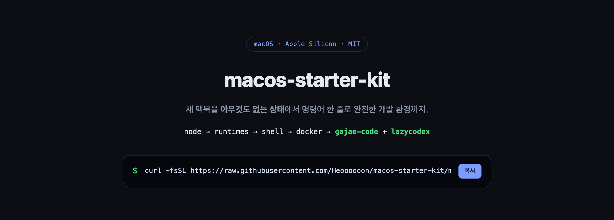

<div align="center">



### AI 코딩, 내 컴퓨터에서 시작하는 가장 빠른 길.

_명령어 한 줄로 새 컴퓨터를 개발 환경으로 — 런타임·셸·컨테이너에 Claude Code 같은 AI 코딩 에이전트까지, 설치부터 검증까지 자동으로._

[](https://github.com/Heoooooon/lazy-starter-kit/actions/workflows/ci.yml)
[](https://github.com/Heoooooon/lazy-starter-kit/releases)
[](./LICENSE)
[](#)
[](https://github.com/Heoooooon/lazy-starter-kit/stargazers)

**한국어** · [English](./README.en.md) · [설치 흐름 보기 ↗](https://heoooooon.github.io/lazy-starter-kit/) · [변경 이력](./CHANGELOG.md)


</div>

---

## 목차

<details><summary>펼쳐서 원하는 곳으로 바로 가기</summary>

- [이게 뭔가요? (1분 설명)](#이게-뭔가요-1분-설명)
- [다른 셋업 스크립트와 뭐가 다른가요?](#다른-셋업-스크립트와-뭐가-다른가요)
- [먼저, 내 컴퓨터부터 고르세요](#먼저-내-컴퓨터부터-고르세요) — [Windows](#windows-설치-제일-자세히) · [macOS](#macos-설치) · [Linux](#linux-설치)
- [설치가 끝난 뒤에도](#설치가-끝난-뒤에도)
- [첫 프롬프트까지 5분](#첫-프롬프트까지-5분)
- [무엇이 깔리나](#무엇이-깔리나)
- [AI 코딩, 여기서 더 확장하세요 (도구 생태계)](#ai-코딩-여기서-더-확장하세요-도구-생태계) — [Grok 수동 설치](#grok-build-xai--수동-설치)
- [설치해도 안전한가요?](#설치해도-안전한가요)
- [지우고 싶어요 (제거)](#지우고-싶어요-제거)
- [자주 묻는 질문 (FAQ)](#자주-묻는-질문-faq)
- [고급 / 커스터마이즈](#고급--커스터마이즈)

</details>

---

## 이게 뭔가요? (1분 설명)

새 노트북/PC를 받으면 개발에 필요한 도구를 **하나하나 찾아 깔아야** 합니다. 이 키트는 그걸
**명령어 한 줄**로 대신 해줍니다. 붙여넣고 Enter만 누르면:

- 자주 쓰는 **CLI 도구**(git, ripgrep, fzf, bat 등)
- **프로그래밍 런타임**(Node.js, Python, Go, Rust)
- **예쁜 터미널/프롬프트**(starship) + 자동완성
- **컨테이너**(Docker) 준비
- **AI 코딩 에이전트**(Claude Code, gajae-code, codex 등)

까지 알아서 깔고, **제대로 깔렸는지 검증**까지 합니다.

> **안심하세요.** 이 키트는 **당신 설정을 함부로 덮어쓰지 않습니다.** 이미 있는 건 건너뛰고,
> 몇 번을 다시 돌려도 안전하며, 설치한 걸 **되돌리는 제거 스크립트**도 있습니다.
> 자세한 안전 설계는 아래 [설치해도 안전한가요?](#설치해도-안전한가요) 참고.

---

## 다른 셋업 스크립트와 뭐가 다른가요?

인터넷의 dotfiles·gist 스크립트는 대개 만든 사람 취향이고, 실행하면 내 컴퓨터에 뭘 바꾸는지 알기 어렵습니다. 이 킷은 세 가지가 다릅니다.

- **초보자 기준으로 썼습니다.** 터미널을 처음 여는 사람도 그대로 따라 하도록 OS별 단계를 하나하나 적었어요.
- **안전을 설계로 증명합니다.** 기존 설정을 덮어쓰지 않고(표시된 블록만 편집·자동 백업), 몇 번을 다시 돌려도 안전하며, 되돌리는 제거 스크립트가 있습니다.
- **말이 아니라 CI로 검증합니다.** macOS·Windows·Ubuntu·Fedora·Arch·openSUSE에서 커밋마다 설치→검증→제거를 자동 테스트해요(2회 연속 설치·업그레이드 경로 포함).

> 실행이 걱정되면 언제든 먼저 `--dry-run`(맥/리눅스)·`-DryRun`(윈도우)으로 "무엇을 할지"만 볼 수 있어요.

---

## 먼저, 내 컴퓨터부터 고르세요

| 내 컴퓨터 | 여기로 |
|---|---|
|  **Windows** (회사 PC 대부분) | [→ Windows 설치](#windows-설치-제일-자세히) |
|  **Mac** (맥북 등) | [→ macOS 설치](#macos-설치) |
|  **Linux** (우분투/페도라 등) | [→ Linux 설치](#linux-설치) |

각 가이드는 **터미널을 처음 여는 분** 기준으로 썼어요. 그대로 따라만 하면 됩니다.

<details>
<summary><b>터미널이 이미 익숙하다면?</b> 한 줄 복붙 모음 (클릭)</summary>

```sh
# macOS
curl -fsSL https://raw.githubusercontent.com/Heoooooon/lazy-starter-kit/main/install.sh | bash

# Linux (Ubuntu/Fedora/Arch/openSUSE — 자동 감지)
curl -fsSL https://raw.githubusercontent.com/Heoooooon/lazy-starter-kit/main/linux/install.sh | bash
```

```powershell
# Windows (PowerShell)
irm https://raw.githubusercontent.com/Heoooooon/lazy-starter-kit/main/windows/install.ps1 | iex
```

실행 전 계획만 보려면 clone 후 `--dry-run`, 회사 PC는 `--profile work`,
상세 옵션은 [고급 / 커스터마이즈](#고급--커스터마이즈).
각 OS는 폴더로 분리돼 있어요: [`windows/`](./windows/README.md) · [`linux/`](./linux/README.md) · macOS(최상위).
</details>

---

##  Windows 설치 (제일 자세히)

> 대상: **Windows 10(1809 이상) 또는 Windows 11**. 대부분의 회사 PC가 여기 해당합니다.
> 개발 경험이 전혀 없어도 아래만 그대로 따라 하면 됩니다.

### 1단계 — PowerShell 열기

1. 키보드에서 **`Windows 키`** 를 누르거나 화면 왼쪽 아래 **시작 버튼**을 클릭합니다.
2. 그대로 **`powershell`** 이라고 타이핑합니다.
3. 목록에 뜨는 **"Windows PowerShell"** 을 클릭해서 엽니다. (파란색 또는 검은색 창이 떠요.)

> 더 좋은 경험을 원하면 "터미널"(Windows Terminal)에서 PowerShell을 열어도 됩니다. 없으면 그냥 Windows PowerShell로 충분해요.

### 2단계 — 아래 한 줄을 붙여넣고 Enter

아래 회색 상자 오른쪽 위의 **복사 버튼**(📋)을 누르세요. 그리고 PowerShell 창을 **한 번 클릭**한 뒤
**마우스 오른쪽 버튼**을 누르면 붙여넣기가 됩니다. 마지막으로 **Enter**.

```powershell
irm https://raw.githubusercontent.com/Heoooooon/lazy-starter-kit/main/windows/install.ps1 | iex
```

- `git`이 없어도 **자동으로 깔아줍니다.** (그냥 기다리면 돼요.)
- 중간에 설치 진행 상황이 주르륵 올라갑니다. 컴퓨터/인터넷 속도에 따라 **5~20분** 걸릴 수 있어요. 창을 닫지 말고 기다리세요.
- 도중에 "Docker Desktop을 설치할까요?" 같은 **질문이 뜨면** 필요 없으면 그냥 `n` 입력 후 Enter (회사 라이선스 이슈가 있어 기본은 설치 안 함). 뭔지 모르겠으면 전부 그냥 Enter — 안전한 기본값으로 진행됩니다.

<details>
<summary><b>"스크립트를 실행할 수 없습니다" 같은 빨간 오류가 뜨면?</b> (클릭)</summary>

Windows 보안 정책 때문일 수 있어요. 아래 **한 줄로 대신 실행**하세요(복붙 → Enter):

```powershell
powershell -ExecutionPolicy Bypass -Command "irm https://raw.githubusercontent.com/Heoooooon/lazy-starter-kit/main/windows/install.ps1 | iex"
```
</details>

### 3단계 — 끝나면 딱 3가지만

설치가 끝나면 화면 맨 아래에 **"Next steps"** 안내가 나옵니다. 그대로 하면 돼요:

1. **PowerShell 창을 완전히 닫고 새로 여세요.** (그래야 새 설정이 적용돼요.)
2. **글꼴 설정** — 프롬프트 아이콘이 예쁘게 보이려면:
   Windows Terminal → **설정(Settings)** → 사용하는 프로필 → **모양(Appearance)** →
   **글꼴(Font face)** 을 **`JetBrainsMono Nerd Font`** 로 바꾸세요.
3. **GitHub 로그인**(선택) — 화면에 `gh auth login` 안내가 나오면 한 번 실행해서 GitHub 계정에 로그인하세요. (git 이름/이메일도 자동으로 맞춰줍니다.)

> **자동완성 써보기**: 새 창에서 명령어를 치기 시작하면 **회색 글씨로 뒷부분을 미리 제안**해줍니다.
> 마음에 들면 **오른쪽 화살표(→)** 를 눌러 그대로 채워요. (zsh의 autosuggestions 같은 기능이에요.)
> 안 뜨면 **PowerShell 7**을 쓰는 게 확실합니다: `winget install Microsoft.PowerShell` 후 재시작.

### 회사 PC에서 자주 겪는 문제 (Windows)

| 증상 | 해결 |
|---|---|
| `winget`을 찾을 수 없다 | Microsoft Store에서 **"앱 설치 관리자(App Installer)"** 설치 후 다시 실행 |
| 일부 도구가 "MISS"로 빠짐 | **관리자 권한(UAC)** 이 필요한 패키지예요. 관리자 PowerShell에서 `.\install.ps1 -Only packages` 재실행하거나 사내 소프트웨어 포털 이용 |
| 회사 프록시 뒤라 다운로드 실패 | PowerShell에서 `$env:HTTPS_PROXY="http://프록시주소:포트"` 설정 후 재실행 |
| 회사 정책(AppLocker 등)으로 스크립트 자체 차단 | 정책상 실행 불가 — IT 담당자 문의 |

> 💡 회사 PC라면 처음부터 가볍게 깔 수도 있어요: `.\install.ps1 -Profile work`
> (Docker 등 무거운 것 제외). 리눅스 환경(WSL2)까지 원하면 `.\install.ps1 -Only wsl` (베타).

📖 **Windows 상세 문서**: [windows/README.md](./windows/README.md)

---

##  macOS 설치

> 대상: **Apple Silicon 맥**(M1/M2/M3/M4…). 새 맥에 최적화돼 있어요.

### 1단계 — 터미널 열기

`Command(⌘) + Space` → **`터미널`** 또는 **`Terminal`** 입력 → Enter.

### 2단계 — 한 줄 붙여넣고 Enter

```sh
curl -fsSL https://raw.githubusercontent.com/Heoooooon/lazy-starter-kit/main/install.sh | bash
```

- `git`이 없는 완전 새 맥이면 먼저 **Xcode Command Line Tools** 설치 창이 뜹니다. **"설치"** 를 누르고, 끝나면 위 명령어를 **한 번 더** 실행하세요.
- 중간에 **Mac 비밀번호**를 한 번 물을 수 있어요(Homebrew 설치 시). 정상입니다.

### 3단계 — 끝나면

- **새 터미널을 열거나** `source ~/.zshrc` 실행.
- 안내에 따라 `gh auth login`(GitHub 로그인), 터미널 글꼴을 `JetBrainsMono Nerd Font`로 설정.

> 실행 전에 **무엇을 하는지 먼저 보고 싶다면**(권장):
> ```sh
> git clone https://github.com/Heoooooon/lazy-starter-kit.git
> cd lazy-starter-kit
> ./install.sh --dry-run   # 아무것도 안 바꾸고 계획만 출력
> ./install.sh             # 실제 적용
> ```

---

##  Linux 설치

> 지원: **Debian/Ubuntu, Fedora/RHEL, Arch, openSUSE** (glibc 배포판). 패키지 매니저를 **자동 감지**합니다.
> ⚠️ **Alpine(musl)은 미지원** — 업스트림 도구(node/ast-grep/bun)에 musl 빌드가 없어요.

### 1단계 — 터미널 열기 → 2단계 — 한 줄 붙여넣고 Enter

```sh
curl -fsSL https://raw.githubusercontent.com/Heoooooon/lazy-starter-kit/main/linux/install.sh | bash
```

- 시스템 패키지 설치에 **sudo(관리자) 비밀번호**를 물을 수 있어요. (sudo가 없으면 시스템
  패키지만 건너뛰고 유저 도구는 정상 설치됩니다.)
- Docker는 물어볼 때 동의해야만 설치됩니다(무거워서 기본은 건너뜀).

### 3단계 — 끝나면

- **새 터미널을 열거나** `source ~/.zshrc`.
- Docker를 깔았다면 **로그아웃 후 다시 로그인**(또는 `newgrp docker`)해야 권한이 적용돼요.

📖 **Linux 상세 문서**: [linux/README.md](./linux/README.md)

---

## 설치가 끝난 뒤에도

이 키트는 한 번 쓰고 버리는 스크립트가 아니에요. 계속 곁에 두고 쓰세요.
(윈도우는 `--flag` 대신 `-Flag` 형태)

- **뭔가 안 될 때** → `./install.sh --doctor`
  어떤 도구가 잘 깔렸는지(✓), 빠졌는지(✗), 깔렸는데 터미널이 못 찾는 건지(!)를
  한눈에 보여주고 **고치는 명령까지 알려줍니다.**
- **새 버전이 나왔을 때** → `./install.sh --update`
  키트 최신 버전을 받아온 뒤 알아서 다시 실행해요.
- **다시 실행하고 싶을 때** → 그냥 `./install.sh`
  이미 된 건 건너뛰고 빠진 것만 채웁니다. 몇 번을 돌려도 안전해요.
- **골라 깔고 싶을 때** → `--profile minimal`(도구+런타임+셸만) /
  `--profile work`(회사 PC용) / `--only agents`(특정 단계만)

---

## 첫 프롬프트까지 5분

도구가 깔린 건 끝이 아니라 시작이에요. "이제 뭘 하지?"에서 멈추지 않도록,
새 터미널에서 그대로 따라 해보세요. (macOS/Linux/Windows 모두 동일하게 됩니다.)

**1. 연습용 폴더 만들기** — 에이전트는 "지금 있는 폴더"를 작업장으로 삼아요.

```sh
mkdir my-first-ai
cd my-first-ai
```

**2. Claude Code 켜기** — 처음 한 번은 로그인을 물어봐요. [claude.ai](https://claude.ai) 계정으로 로그인하면 됩니다.

```sh
claude
```

**3. 첫 프롬프트 붙여넣기** — 아래를 그대로 복사해서 Enter:

> 이 폴더에 브라우저에서 바로 열 수 있는 한 파일짜리 벽돌깨기 게임(index.html)을 만들어줘. 다 만들면 여는 방법도 알려줘.

몇 분 뒤 `index.html`이 생기고, 더블클릭하면 **AI와 만든 첫 결과물**이 브라우저에서 돌아갑니다.

- Claude 대신 Codex를 쓰려면: `codex` 실행 후 ChatGPT 계정으로 로그인.
- Grok을 쓰려면: 킷 설치 후 [Grok 수동 설치](#grok-build-xai--수동-설치) → `grok` 실행 후 grok.com 로그인.
- 개념 정리·다음 프로젝트·도구 확장은 **[cmore.dev](https://cmore.dev/)** 에 순서대로 정리돼 있어요.

---

## 무엇이 깔리나

이름이 낯설어도 괜찮아요 — 전부 전 세계 개발자들이 매일 쓰는 검증된 도구들입니다.

| 계층 | 도구 |
|---|---|
| **CLI 기본** | git, gh(GitHub CLI), jq, ripgrep(rg), fd, fzf, bat, tree, ast-grep |
| **셸/프롬프트** | zsh + oh-my-zsh + 자동완성·구문강조, **starship** 프롬프트, JetBrainsMono Nerd Font (Windows는 PowerShell 프로필 + PSReadLine 자동완성) |
| **런타임** | **mise** → Node(LTS)·Python·Go · **rustup** → Rust + rust-analyzer · **uv** · **bun** |
| **컨테이너** | macOS=Colima, Linux=Docker Engine(선택), Windows=Docker Desktop(선택·라이선스 주의) 또는 WSL2 |
| **Git/GitHub** | 계정 신원(이메일), HTTPS 자격증명, 합리적 기본값 |
| **AI 에이전트** | **Claude Code**(`claude`), **gajae-code**(`gjc`), **codex**, **lazycodex**(OmO) (+ macOS/Linux는 Hermes) |
| **WSL2** (Windows, 베타) | WSL2 + Ubuntu 활성화 후 그 안에 Linux 킷 자동 설치 (`-Only wsl`) |

> 세부 목록·OS별 차이는 각 OS 상세 문서에 있어요.

---

## AI 코딩, 여기서 더 확장하세요 (도구 생태계)

이 킷은 **AI 코딩 에이전트**를 깔아줍니다. 하지만 에이전트의 진짜 힘은 거기에 붙여 쓰는 **스킬·MCP·플러그인**에서 나와요. 뭘 붙일지 고르는 것도 또 다른 삽질이라, 따로 큐레이션해 뒀습니다.

> **→ [cmore.dev 도구 생태계](https://cmore.dev/lazy-starter-kit/ecosystem/)**
> 분야별(문서·행정·법률·게임·디자인·코딩 에이전트 등) 도구를, 직접 써보고 쓴 **에디터 리뷰 + 솔직한 한계**와 함께 모았습니다(대부분 오픈소스, 일부는 무료로 쓰는 공식 도구). 설치 명령까지 바로 복사할 수 있어요.

킷이 기본으로 깔아주는 에이전트는 이렇습니다:

| 에이전트 | 한 줄 소개 |
|---|---|
| **[Claude Code](https://cmore.dev/lazy-starter-kit/ecosystem/claude-code/)** (`claude`) | 내 프로젝트 안에서 직접 코드를 읽고 고치는 Anthropic 에이전트 |
| **[Codex](https://cmore.dev/lazy-starter-kit/ecosystem/codex/)** (`codex`) | 터미널에서 도는 OpenAI 코딩 에이전트 |
| **[gajae-code](https://cmore.dev/lazy-starter-kit/ecosystem/gajae-code/)** (`gjc`) | 인터뷰·검토된 계획·검증까지 갖춘 자율 코딩 러너 |
| **[lazycodex](https://cmore.dev/lazy-starter-kit/ecosystem/lazycodex/)** (OmO) | 복잡한 코드베이스를 위한 Codex 하네스 |
| **[Hermes](https://cmore.dev/lazy-starter-kit/ecosystem/hermes-agent/)** (macOS·Linux) | 경험에서 스킬을 만들고 세션 너머로 나를 학습하는 자율 에이전트 |
| **[Grok Build](https://x.ai/cli)** (`grok`) | xAI 코딩 에이전트 — **킷 자동 설치 미포함**, 아래 수동 설치 |

에이전트 이름을 누르면 각 도구의 **자세한 에디터 리뷰·설치법**으로 바로 갑니다.

### Grok Build (xAI) — 수동 설치

> 아직 `install.sh` / `install.ps1` 에이전트 단계에 **포함되지 않습니다.** 키트 설치 후 아래 한 줄만 따로 실행하세요.

**macOS / Linux**
```sh
curl -fsSL https://x.ai/cli/install.sh | bash
```

**Windows (PowerShell)**
```powershell
irm https://x.ai/cli/install.ps1 | iex
```

설치 확인 → 실행 → 로그인:

```sh
grok --version   # 설치 확인
grok             # 첫 실행 시 브라우저에서 grok.com 로그인
```

- **구독**: SuperGrok 또는 X Premium Plus 필요 ([안내](https://x.ai/cli)).
- **API 키 방식**(CI·브라우저 없는 환경): `export XAI_API_KEY="xai-..."` 후 `grok`.
- **업데이트**: `grok update`
- 바이너리는 보통 `~/.grok/bin`(Windows: `%USERPROFILE%\.grok\bin`)에 깔립니다. PATH에 안 잡히면 **터미널을 새로 열거나** 해당 경로를 PATH에 추가하세요.

---

## 설치해도 안전한가요?

네. 안전을 최우선으로 설계했고, **말로만이 아니라 테스트로 증명합니다.**

- **덮어쓰지 않음**: 이미 깔린 도구/설정은 건너뜁니다. 당신이 만든 파일은 보존돼요.
- **몇 번을 다시 돌려도 안전**: CI가 매 커밋 **두 번 연속 설치**해서 확인합니다(멱등).
- **표시된 블록만 편집**: 설정 파일(`~/.zshrc`, PowerShell 프로필 등)에는 `# >>> lazy-starter-kit ... >>>` 로
  **명확히 표시된 구역**만 넣고, 재실행 시 그 구역만 교체합니다(중복 없음). 손으로 쓴 줄은 안 건드려요.
  처음 고치기 전엔 **자동 백업**(`.bak`)을 만들고, 마커가 손상돼 있으면 수정을 거부합니다.
- **git 신원 보호**: 이름/이메일이 **비어 있을 때만** 채우고, 있으면 절대 안 바꿉니다.
- **데이터 삭제 없음**: 설치 과정에서 당신 데이터를 지우지 않습니다.
- **되돌리기 제공**: 아래 [제거](#지우고-싶어요-제거)로 깔끔히 원복.
- **공급망(supply chain) 정직 고지**: 이 키트는 Homebrew·oh-my-zsh·Docker·Hermes 등 **업스트림 프로젝트의 공식 설치 스크립트를 HTTPS로** 내려받아 실행하고, npm/bun 패키지는 **최신 버전으로** 설치합니다. 즉 그 업스트림들을 신뢰하는 셈이니, 걱정되면 각 프로젝트를 먼저 확인하세요. 보안 범위·신고는 [SECURITY.md](./SECURITY.md) 참고.

> 정말 걱정되면 **먼저 `--dry-run`(맥/리눅스) 또는 `-DryRun`(윈도우)** 으로 "무엇을 할지"만 확인하세요.
> 남의/회사 메인 PC라면 **여분 PC나 가상머신(VM)에서 먼저** 테스트하는 걸 권합니다.

> **검증**: **macOS·Windows(Server 2025)·Ubuntu·Fedora·openSUSE·Arch** 모두
> 커밋마다 설치→검증→제거(end-to-end)를 자동 테스트(CI)로 돌립니다.
> 두 번 연속 설치(멱등성)와 **이전 릴리스→최신 업그레이드 경로**도 테스트에 포함돼요.

### 지원 범위

| 등급 | 플랫폼 | 보증 |
|---|---|---|
| **Tier 1** | macOS 14+ (Apple Silicon) · Windows 11/Server 2025 · Ubuntu 24.04 · Fedora · Arch · openSUSE Tumbleweed | **매 커밋마다 CI가 실제로 설치→검증→제거** (+ 2회 연속 설치, 업그레이드 경로) |
| **Tier 2** | Windows 10 1809+ · Debian 12+ · RHEL 9/Rocky · openSUSE Leap · WSL2 · Intel Mac | 같은 코드라 동작 예상 — 문제 제보 시 우선 수정 |
| 미지원 | Alpine(musl) · 32bit | 업스트림 도구에 빌드가 없음 |

자세한 정책(무엇이 semver로 보호되는지)은 [VERSIONING.md](./VERSIONING.md) 참고.


> 이 키트가 세팅 시간을 아껴줬다면 **⭐ 스타 하나**가 다음 개선의 큰 힘이 됩니다!

---

## 지우고 싶어요 (제거)

설치한 것을 의존성 역순으로 되돌립니다. (위험한 항목은 물어보고 진행)

**macOS**
```sh
cd lazy-starter-kit && ./uninstall.sh          # 물어보며 제거
./uninstall.sh --yes                            # 다 자동 수락
```
**Linux**
```sh
cd lazy-starter-kit/linux && ./uninstall.sh
```
**Windows** (PowerShell)
```powershell
cd lazy-starter-kit\windows; .\uninstall.ps1
```

- **git 신원, git 자체, 폰트, Homebrew/빌드도구**는 자동으로 안 지웁니다.
- **gajae-code(`gjc`)는 보존** — 지우려면 `--with-gajae`(맥/리눅스) / `-WithGajae`(윈도우).

---

## 자주 묻는 질문 (FAQ)

**Q. 이미 Node/Python이 깔려 있어요. 충돌 안 나요?**
지우지 않습니다. mise가 **자기 버전을 깔고 PATH로 우선**시켜요(shadow). 기존 것은 그대로 남습니다.
확인: 맥/리눅스 `which -a node`, 윈도우 `Get-Command node -All`.

**Q. 설치가 중간에 실패했어요.**
대부분 네트워크/권한 문제예요. **다시 실행해도 안전**합니다(이미 된 건 건너뜀).
뭐가 빠졌는지는 `--doctor`로 확인하고, 특정 단계만 다시는 `--only <단계>`(맥/리눅스), `-Only <단계>`(윈도우).

**Q. 관리자 권한이 없어요(회사 PC).**
Windows는 가능한 건 **사용자 범위로 설치**하고, 관리자가 필요한 것만 끝에 목록으로 알려줍니다.
Linux는 sudo가 없으면 시스템 패키지는 건너뛰고 사용자 도구는 정상 설치돼요.

**Q. 특정 버전으로 고정해서 설치하려면?**
```sh
STARTER_KIT_BRANCH=v0.7.0 bash -c "$(curl -fsSL https://raw.githubusercontent.com/Heoooooon/lazy-starter-kit/v0.7.0/install.sh)"
```

**Q. 여기 없는 질문은 어디서 물어보나요?**
[GitHub Discussions](https://github.com/Heoooooon/lazy-starter-kit/discussions)에 편하게 올려주세요.
버그 같으면 [이슈](https://github.com/Heoooooon/lazy-starter-kit/issues)로, "이게 왜 안 되지?" 수준이면 Discussions가 맞아요 — 초보 질문 환영입니다.

---

## 고급 / 커스터마이즈

- **모든 플래그**: `--dry-run`, `--yes`, `--only`, `--skip`, `--profile`, `--doctor`, `--update`, `--list`, `--version` (윈도우는 `-Only` 처럼 대시 하나).
- **설치 도구 편집**: 각 OS의 `Brewfile`(맥) / `scripts/02-packages.*` / `scripts/03-runtimes.*`.
- **프롬프트/셸 블록**: `config/starship.toml`, `config/zshrc.block.sh`(맥/리눅스), `config/profile.block.ps1`(윈도우).
- 자세한 옵션·문제해결은 각 OS 상세 문서를 보세요.

---

## 크레딧

이 키트는 훌륭한 오픈소스들을 엮은 것뿐입니다. 원작 프로젝트에 ⭐를 눌러주세요:
[Homebrew](https://brew.sh) · [mise](https://github.com/jdx/mise) · [starship](https://github.com/starship/starship) ·
[rustup](https://github.com/rust-lang/rustup) · [bun](https://github.com/oven-sh/bun) · [uv](https://github.com/astral-sh/uv) ·
[Oh My Zsh](https://github.com/ohmyzsh/ohmyzsh) · [ripgrep](https://github.com/BurntSushi/ripgrep) ·
[fd](https://github.com/sharkdp/fd) · [bat](https://github.com/sharkdp/bat) · [fzf](https://github.com/junegunn/fzf) ·
[ast-grep](https://github.com/ast-grep/ast-grep) · [Colima](https://github.com/abiosoft/colima) ·
[Claude Code](https://github.com/anthropics/claude-code) · [gajae-code](https://github.com/Yeachan-Heo/gajae-code) · [Codex](https://github.com/openai/codex) ·
[lazycodex / OmO](https://github.com/code-yeongyu/lazycodex) · [Hermes Agent](https://github.com/NousResearch/hermes-agent) · [Grok Build](https://x.ai/cli)

## 라이선스

MIT — [LICENSE](./LICENSE) 참고.
