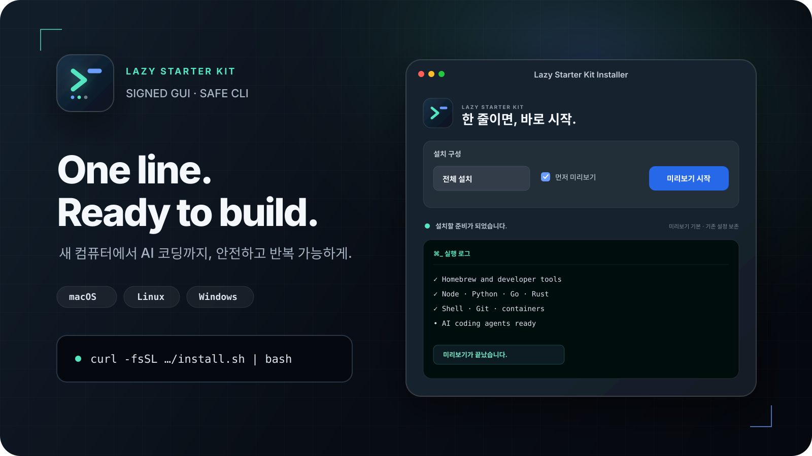

<div align="center">



### 사람마다 다른 출발선을 한 줄로 맞춥니다.

AI 코딩, 내 컴퓨터에서 시작하는 가장 빠른 길.

[](https://github.com/Heoooooon/lazy-starter-kit/actions/workflows/ci.yml)
[](https://github.com/Heoooooon/lazy-starter-kit/releases)
[](./LICENSE)
[](#)

**한국어** · [English](./README.en.md) · [변경 이력](./CHANGELOG.md)

</div>

---

## 이게 뭔가요?

새 노트북이나 PC에서 개발을 시작하려면 Git, 런타임, 터미널 도구, Docker,
AI 코딩 에이전트 등을 하나씩 설치해야 합니다.

lazy-starter-kit은 이 과정을 한 번에 구성하고, 설치가 끝난 뒤 제대로
동작하는지 확인할 수 있게 만든 개발 환경 부트스트랩입니다.

설치되는 주요 항목:

- CLI: git, gh, jq, ripgrep, fd, fzf, bat, tree, ast-grep, zoxide
- 런타임: Node.js, Python, Go, Rust
- 셸/프롬프트: zsh, oh-my-zsh, starship, Nerd Font
- 컨테이너: macOS Colima, Linux Docker Engine, Windows Docker Desktop(선택)
- AI 에이전트: Claude Code, gajae-code, Codex, lazycodex

이미 있는 도구는 가능한 한 그대로 두고, 관리하는 설정 파일은 표시된
블록만 수정합니다. 상태 확인은 `--doctor`, 실행 전 확인은 `--dry-run`을
사용하세요.

---

## 설치

### macOS

```bash
curl -fsSL https://raw.githubusercontent.com/Heoooooon/lazy-starter-kit/main/install.sh | bash
```

### Linux

Ubuntu/Debian, Fedora/RHEL, Arch, openSUSE 계열을 지원합니다.

```bash
curl -fsSL https://raw.githubusercontent.com/Heoooooon/lazy-starter-kit/main/linux/install.sh | bash
```

상세 문서: [linux/README.md](linux/README.md)

### Windows

PowerShell에서:

```powershell
irm https://raw.githubusercontent.com/Heoooooon/lazy-starter-kit/main/windows/install.ps1 | iex
```

상세 문서: [windows/README.md](windows/README.md)

GUI/더블클릭 설치 파일은 [Releases](https://github.com/Heoooooon/lazy-starter-kit/releases)에서 받을 수 있습니다.

---

## 먼저 확인하고 싶다면

남의 스크립트를 바로 실행하기 꺼려진다면 clone 후 dry-run을 권장합니다.

```bash
git clone https://github.com/Heoooooon/lazy-starter-kit.git
cd lazy-starter-kit
./install.sh --dry-run
```

Windows:

```powershell
git clone https://github.com/Heoooooon/lazy-starter-kit.git
cd lazy-starter-kit\windows
.\install.ps1 -DryRun
```

---

## 자주 쓰는 옵션

macOS/Linux:

```bash
./install.sh --dry-run
./install.sh --doctor
./install.sh --update
./install.sh --only agents
./install.sh --skip docker
./install.sh --profile minimal
./install.sh --profile work
```

Windows는 `--dry-run` 대신 `-DryRun`, `--only` 대신 `-Only`처럼 PowerShell
형식을 사용합니다.

설치 단계는 여러 번 실행해도 같은 관리 블록을 중복 생성하지 않도록
멱등성을 기준으로 설계되어 있습니다.

---

## 설치 후 확인

```bash
./install.sh --doctor
```

`--doctor`는 도구별로 다음 상태를 보여줍니다.

- 정상 설치됨
- 설치됐지만 PATH에서 찾지 못함
- 설치되지 않음

문제가 있는 단계만 다시 실행할 수도 있습니다.

```bash
./install.sh --only runtimes
./install.sh --only agents
```

---

## 자동 제거(Uninstall)는 지원하지 않습니다

**lazy-starter-kit은 자동 uninstall 기능을 제공하지 않습니다.**

이전 버전에는 제거 스크립트가 있었지만 폐기했습니다. 이유는 설치 이후
시점만 보고는 어떤 도구가 lazy-starter-kit이 새로 설치한 것인지, 사용자가
원래 사용하던 것인지 신뢰성 있게 구분할 수 없기 때문입니다.

예를 들어 사용자가 이미 Codex, Claude Code, Homebrew 패키지, mise,
oh-my-zsh 등을 사용하고 있었다면 이름이나 경로만 기준으로 자동 삭제하는
방식은 기존 개발 환경이나 사용자 데이터를 지울 위험이 있습니다.

따라서 현재 정책은 다음과 같습니다.

- 자동으로 패키지나 개발 도구를 제거하지 않습니다.
- 기존 `uninstall.sh`, `linux/uninstall.sh`, `windows/uninstall.ps1` 진입점은
  삭제 작업을 수행하지 않고 중단합니다.
- 특정 도구를 제거해야 한다면 해당 도구의 공식 제거 방법을 사용하세요.
- `.zshrc`, `.zprofile`, PowerShell profile의
  `lazy-starter-kit` 표시 블록은 내용을 확인한 뒤 수동으로 제거하세요.

향후 설치 시점의 소유권을 신뢰성 있게 기록하는 방식이 마련되기 전까지
자동 제거 기능은 다시 추가하지 않습니다.

---

## 안전 설계

- **Dry run**: 적용 전에 실행 계획을 확인할 수 있습니다.
- **기존 설정 보호**: 사용자 설정 전체를 교체하지 않고 관리 블록을 사용합니다.
- **손상된 마커 fail-closed**: 관리 블록 마커가 비정상이면 파일 수정을 거부합니다.
- **설정 백업**: 관리 파일을 처음 변경할 때 `.bak` 백업을 만듭니다.
- **재귀 삭제 경계 검사**: 내부 정리가 필요한 경우 HOME/루트/경계 밖/심볼릭 링크를 거부합니다.
- **AI shell guard**: Codex/Claude Code의 재귀 `rm` 호출을 차단하는 추가 방어층을 제공합니다.
- **공개 릴리스 기준 설치**: 기본 설치와 detached checkout의 업데이트는 단순히 가장 최신 `v*` 태그를 고르지 않고, GitHub가 실제 공개한 **최신 published Release**를 기준으로 실행합니다. 아직 빌드 중이거나 실패한 태그는 기본 설치 대상으로 선택되지 않습니다.
- **릴리스 게이트**: 태그 커밋의 `ci.yml`이 성공하고 macOS/Windows 패키징·서명·attestation이 모두 끝날 때까지 Release는 draft 상태로 유지되며, 모든 단계가 성공한 뒤에만 공개됩니다.
- **CI**: macOS, Windows, Ubuntu, Fedora, Arch, openSUSE에서 설치와 상태 검증을 자동 실행합니다.

이 키트는 Homebrew, npm/bun 패키지, 각 프로젝트의 공식 설치 프로그램 등
여러 외부 공급망을 신뢰합니다. 자세한 범위는 [SECURITY.md](SECURITY.md)를
참고하세요.

---

## 이미 Node/Python이 설치되어 있다면

기존 런타임을 삭제하지 않습니다. Node/Python/Go는 mise가 별도 버전을
설치하고 새 셸에서 우선 사용하도록 구성할 수 있습니다.

macOS/Linux:

```bash
which -a node
which -a python
```

Windows:

```powershell
Get-Command node -All
Get-Command python -All
```

---

## 회사 PC

가벼운 설정만 원하면 work profile을 사용할 수 있습니다.

```bash
./install.sh --profile work
```

Windows:

```powershell
.\install.ps1 -Profile work
```

관리자 권한이나 사내 정책 때문에 설치할 수 없는 항목은 건너뛰거나 안내를
출력합니다. AppLocker, MDM, 프록시 등 조직 정책으로 실행 자체가 차단된
환경에서는 IT 관리자 정책을 따라야 합니다.

---

## 개발 / 기여

- 설계: [DESIGN.md](DESIGN.md)
- 버전 정책: [VERSIONING.md](VERSIONING.md)
- 보안 정책: [SECURITY.md](SECURITY.md)
- 기여 가이드: [CONTRIBUTING.md](CONTRIBUTING.md)
- 변경 이력: [CHANGELOG.md](CHANGELOG.md)

```bash
./install.sh --dry-run
./install.sh --doctor
```

CI는 셸 문법, shellcheck/PSScriptAnalyzer, 설치, 멱등성, doctor,
업그레이드 경로와 주요 안전 회귀 테스트를 확인합니다.

---

## 라이선스

MIT — [LICENSE](LICENSE)
