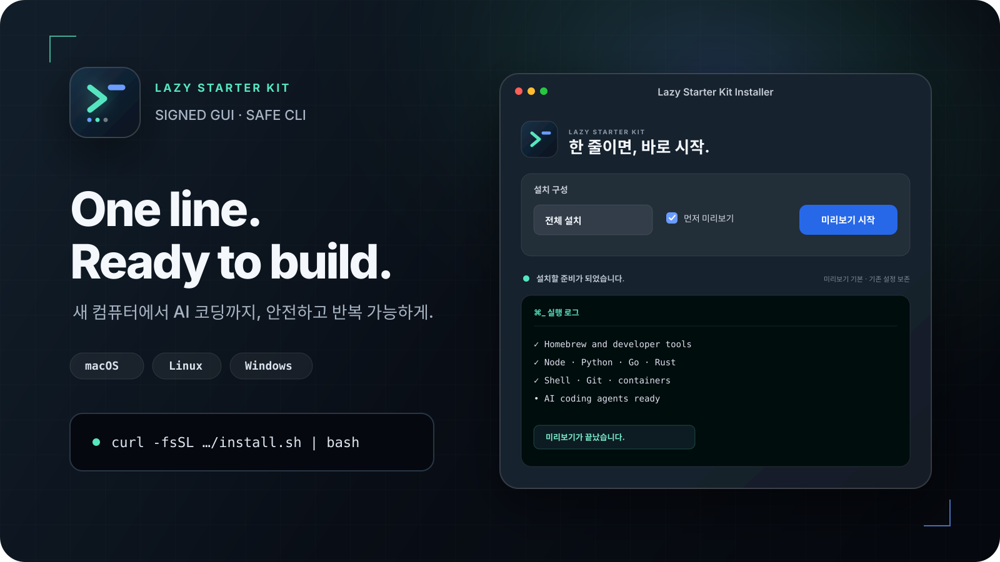

<div align="center">

[English](./README.md) · **简体中文** · [日本語](./README.ja.md) · [한국어](./README.ko.md)



*此插图展示的是旧版本 full 配置的预览，并不代表当前推荐配置的安装或验证结果。请按照下方的[当前推荐安装](#recommended-setup)操作。*

### 机器各不相同，起跑线只有一条。

在自己的电脑上开始 AI 编程的最快方式。

[](https://github.com/Heoooooon/lazy-starter-kit/actions/workflows/ci.yml)
[](https://github.com/Heoooooon/lazy-starter-kit/releases)
[](./LICENSE)
[](#)

[推荐安装](#recommended-setup) · [第一个项目](#first-project) · [更新日志](./CHANGELOG.md)

</div>

---

## 这是什么？

拿到一台新笔记本或新电脑，通常要把 Git、各种运行时、终端工具、Docker
和 AI 编程代理一个个装一遍。

lazy-starter-kit 一次性把这套开发环境搭好，并提供事后验证结果的方法。

v0.14.1 的默认 `ai` 配置会准备 **Git、Node.js LTS/npm、Claude Code、
Codex、安全钩子（safety hooks）以及最小化的 PATH 设置**，外加安装它们所需的前置依赖。
它不包含 Python、Go、Rust、Docker、Bun、uv、Shell 美化、字体或可选的 CLI 工具包。

**从 v0.14.1 开始：** 使用下方的[发布版下载或固定版本的源码命令](#recommended-setup)，
即可获得更精简的 AI 配置和引导式首次运行。v0.13.0 已经有 `recommended`
开发者配置和入门指引，但还没有默认的 `ai` 配置和新的 GUI 流程。

显式指定的 `recommended` 配置仍保留更完整的开发者工具包：

- CLI：git、gh、jq、ripgrep、fd、fzf、bat、tree、ast-grep、zoxide
- 运行时：Node.js、Python、Go、Rust
- Shell/提示符：macOS/Linux 上为 zsh 和 oh-my-zsh，Windows 上为 PowerShell；另有 starship、Nerd Font
- AI 代理：Claude Code（`claude`）和 Codex（`codex`）

不包含 Docker，Windows 上也不包含 WSL。Hermes 是面向 macOS/Linux 的高级可选项，
例如在审阅过的源码目录中运行 `HERMES=1 ./install.sh --profile recommended`
（Linux 上使用 `./linux/install.sh`）。`ai` 会刻意忽略哪怕是继承来的 `HERMES=1`；
Windows 没有原生的 Hermes 安装程序。
当前版本既不会安装、也不会删除已停用的代理，例如 gajae-code（`gjc`）和
lazycodex，也不会动它们已有的配置。

在可行的情况下，已有工具会保持原样；受管理的配置文件只会在明确标记的区块内修改。
用 `--doctor` 检查当前状态，用 `--dry-run` 在实际应用前预览改动。

---

<a id="ai-setup"></a>

## AI 配置（v0.14.1）

不指定配置、也不自定义步骤的普通 GUI 和 CLI 安装，现在都使用 `ai`。
显式指定的 `recommended`、`full`、`minimal` 和 `work` 保持原有内容。
**`recommended` 不是 `ai` 的别名**：它仍会安装更完整的开发者工具包，只是不含
Docker 和 Windows WSL。

| 操作系统 | `ai` 中的 Node.js LTS |
|---|---|
| macOS | Homebrew `node@24`，含 npm |
| Linux | mise `node@lts`，含 npm |
| Windows | winget `OpenJS.NodeJS.LTS`，含 npm |

**为什么需要 Node.js 和 npm？** Codex 通过 npm 安装，而 Node.js 负责运行安全钩子
安装程序以及 AI 工具的安全钩子。入门时你不需要自己挑选运行工具，按照下方对应系统的
安装说明操作即可。

<details>
<summary>工具术语说明：Node.js、npm、Bun、bunx、mise</summary>

| 名称 | 作用 |
|---|---|
| Node.js | 运行用 JavaScript 编写的程序。 |
| npm | 通常随 Node.js 一起提供，用于下载项目依赖包或 CLI 工具。 |
| Bun | 安装依赖包，并运行 JavaScript 和 TypeScript 程序。 |
| bunx | 随 Bun 一起提供。查找并运行 CLI 工具，必要时自动下载。 |
| mise | 安装并切换 Node.js、Bun 等开发工具的版本。 |

**安装和运行是两回事。** 许多通过 npm 获取的包也能用 Bun 安装，但有些需要额外的
安装设置，或者需要 Node.js 才能运行。用 Bun 装好了一个程序，并不保证它不依赖
Node.js 就能运行。

**有定义不等于已包含。** 当前默认的 `ai` 配置不会安装 Bun/bunx。Linux 用 mise
安装 Node.js，而 macOS 和 Windows 的默认 `ai` 配置不会安装 mise。高级配置的
范围各不相同，安装前请先查看预览。

了解更多：[Bun 包安装](https://bun.com/docs/pm/cli/install)、
[bunx 运行](https://bun.com/docs/pm/bunx)、
[mise 版本选择](https://mise.jdx.dev/getting-started.html)。

</details>

**安装之前：** 下载和 AI 服务都需要联网。Claude Code 需要一个有服务权限的
Claude 账号或受支持的 API 凭据；Codex 需要一个有服务权限的 ChatGPT 账号或受支持的
API 凭据。安装本身不包含订阅、服务权限或额度。请先查看服务商的条款、计费方式以及
你所在组织的政策。新版 GUI 会在安装前展示这些要求。

在 v0.14.1 的 GUI 中，**Install（安装）** 是主操作，**Preview（预览）** 是一个
不做任何改动的独立操作。预览完成或安装程序成功退出，都不能单独说明这台机器已经就绪。
Git、Node、npm、Claude Code 和 Codex 必须真正能运行并通过版本检查。缺少可执行文件
或检查失败意味着 **需要处理**，而不是 **已就绪**。本地就绪检查不会测试登录认证，
也不会测试与服务商的实时会话。

在全新的 Mac 上，请按提示完成 Xcode Command Line Tools 或 Homebrew 等前置依赖的
安装。如果安装转到终端（Terminal）中继续进行，请在那里完成，然后回到 GUI 的结果
检查，再开始练习。检查安装后的 PATH 时请打开一个新的终端窗口，而不是用安装前的那个
Shell。

如需通过 CLI 安装，请用[下方](#recommended-setup)的命令获取 **v0.14.1 源码**，
审阅安装程序及其脚本，然后在源码根目录中只运行你所用系统那一行的命令：

| 操作系统 | 预览 | 安装 | 在新终端中检查 |
|---|---|---|---|
| macOS | `bash ./install.sh --profile ai --dry-run` | `bash ./install.sh --profile ai` | `bash ./install.sh --profile ai --doctor` |
| Linux | `bash ./linux/install.sh --profile ai --dry-run` | `bash ./linux/install.sh --profile ai` | `bash ./linux/install.sh --profile ai --doctor` |
| Windows | `powershell.exe -NoProfile -ExecutionPolicy Bypass -File .\windows\install.ps1 -Profile ai -DryRun` | `powershell.exe -NoProfile -ExecutionPolicy Bypass -File .\windows\install.ps1 -Profile ai` | `powershell.exe -NoProfile -ExecutionPolicy Bypass -File .\windows\install.ps1 -Profile ai -Doctor` |

如果缺少某个必需工具，请查看它的日志并解决报告的问题，然后重新运行同一个 `ai`
配置。自定义的 `--only` / `-Only`，或不带配置的 `--skip` / `-Skip`，仍会沿用更宽的
开发者步骤内容，不要把它们当作精简 AI 配置的修复捷径。未知的配置名和步骤 ID 会被拒绝，
并列出有效名称；配置与 `--only` / `-Only` 不能同时使用。

检查通过后，在 GUI 中选择 Claude Code 或 Codex，并明确地在一个 **新的空练习文件夹**
中启动它。“复制提示词”只会把入门请求放到剪贴板，不会替你提交。请自己登录、审阅提示词
并发送。本工具没有自动卸载功能，也没有删除界面。手动操作的等价步骤见
[第一个项目](#first-project)。

---

<a id="recommended-setup"></a>

## 推荐安装（v0.14.1）

**第一次接触？macOS 用户请使用下方的 v0.14.1 GUI。Windows GUI 仍处于实验阶段。**
默认的 `ai` 配置会装好 Claude Code 和 Codex，不含 Docker 和 Windows WSL。
v0.14.1 既不会安装、也不会删除 gajae-code（`gjc`）、lazycodex 或它们已有的配置，
也不提供自动卸载。

<a id="gui-downloads"></a>

### GUI 下载

| 操作系统 | v0.14.1 GUI 安装包 | 解压后打开 |
|---|---|---|
| macOS 14+，Apple Silicon 或 Intel | [lazy-starter-kit-macos-gui.zip](https://github.com/Heoooooon/lazy-starter-kit/releases/download/v0.14.1/lazy-starter-kit-macos-gui.zip) | `Lazy Starter Kit Installer.app` |
| Windows（实验性） | [lazy-starter-kit-windows-gui.zip](https://github.com/Heoooooon/lazy-starter-kit/releases/download/v0.14.1/lazy-starter-kit-windows-gui.zip) | `Lazy-Starter-Kit-Installer.cmd` |
| Linux | 无 GUI 安装包 | 使用下方的 v0.14.1 源码命令或 [Linux 指南](linux/README.md) |

**Windows 为实验性支持：** 自动化测试和安装包验证均已通过。但在真实 Windows 电脑上
的手动验证，尚未覆盖从双击启动器、经过安装界面和权限提示、到安装完成和首次运行的
完整流程。

GUI 默认选中 **ai**，以 **Install（安装）** 为主操作，另有独立的 **Preview（预览）**
按钮。可以先不安装、只查看计划，准备好后再点安装。不指定配置、也不自定义步骤的普通
CLI 安装同样使用 `ai`。AI 计划不包含 `docker` 和 Windows 的 `wsl`。预览、安装失败
或取消，以及未完成的就绪检查，都不会解锁首次运行的控件。
安装完成且检查通过后，继续阅读
[打开新终端、检查版本并开始第一个项目](#first-project)。
账号登录和第一条提示词仍需手动完成。

更新内容和全部安装包见 [v0.14.1 发布页](https://github.com/Heoooooon/lazy-starter-kit/releases/tag/v0.14.1)。
打包好的 GUI 会固定到各自的发布提交；标准的远程引导脚本默认解析最新发布的
GitHub Release。`main` 分支上的改动不会自动更新发布版 ZIP。

**v0.13.0** 在不指定配置的 CLI 安装中使用 full，GUI 中则是 recommended + 预览。
它的显式开发者配置和不卸载策略在 v0.14.1 中得以保留；但它的 ZIP 不会获得新的 AI 流程。

更早的 **v0.12.0** 没有 `recommended` 配置，其 GUI 默认是 full + 预览。它仍会安装
gajae-code 和 lazycodex，并带有旧的自动卸载行为。请不要用它来完成本文所述的配置。

### 从源码安装（Linux 或终端用户）

下方命令会克隆 **v0.14.1 标签** 并运行本地安装程序。
请先安装 [Git](https://git-scm.com/downloads) 并打开一个新终端；或者下载
[v0.14.1 源码 ZIP](https://github.com/Heoooooon/lazy-starter-kit/archive/refs/tags/v0.14.1.zip)，
解压后在 `lazy-starter-kit-0.14.1` 中打开终端。使用 ZIP 时，跳过 clone 和 `cd`
命令。请使用一个新文件夹，而不是已有的仓库目录。

### 1. 审阅并预览

运行之前，先在编辑器中打开安装程序及其 `scripts/` 文件夹。
预览只会列出选中的步骤，不会实际安装。请确认计划中没有 `docker`，
在 Windows 上也没有 `wsl`。

### macOS

```bash
git clone --branch v0.14.1 --single-branch https://github.com/Heoooooon/lazy-starter-kit.git lazy-starter-kit-v0.14.1
cd lazy-starter-kit-v0.14.1
# Inspect install.sh and scripts/, then preview:
bash ./install.sh --profile ai --dry-run
```

### Linux

支持 Ubuntu/Debian、Fedora/RHEL、Arch 和 openSUSE 系列：

```bash
git clone --branch v0.14.1 --single-branch https://github.com/Heoooooon/lazy-starter-kit.git lazy-starter-kit-v0.14.1
cd lazy-starter-kit-v0.14.1
# Inspect linux/install.sh and linux/scripts/, then preview:
bash ./linux/install.sh --profile ai --dry-run
```

平台细节：[Linux 指南](linux/README.md)。

### Windows

在 PowerShell（5.1 或更高版本）中：

```powershell
git clone --branch v0.14.1 --single-branch https://github.com/Heoooooon/lazy-starter-kit.git lazy-starter-kit-v0.14.1
cd lazy-starter-kit-v0.14.1
# Inspect windows/install.ps1 and windows/scripts/, then preview:
powershell.exe -NoProfile -ExecutionPolicy Bypass -File .\windows\install.ps1 -Profile ai -DryRun
```

`-ExecutionPolicy Bypass` 只对这个子进程生效，不会改动你保存的 PowerShell 策略。
公司策略仍可能阻止执行；请不要为了绕过 IT 限制而修改策略。
平台细节：[Windows 指南](windows/README.md)。

### 2. 应用审阅过的计划

留在同一个源码文件夹中，**只运行你所用系统的命令**：

| 操作系统 | 应用 |
|---|---|
| macOS | `bash ./install.sh --profile ai` |
| Linux | `bash ./linux/install.sh --profile ai` |
| Windows | `powershell.exe -NoProfile -ExecutionPolicy Bypass -File .\windows\install.ps1 -Profile ai` |

请在审阅后再批准必要的系统提示。macOS 可能需要安装 Xcode Command Line Tools 并
设置 Homebrew；请按前置依赖指引操作，如有要求就重新运行同一条命令。留意警告信息和
被跳过的步骤。安装程序成功退出，并不能证明所有工具都已安装或已登录。
接下来请继续[打开新终端并开始第一个项目](#first-project)。

---

## 常用选项

以下显式的开发者配置选项在 v0.14.1 中仍然可用。
请在源码根目录运行（Linux 上把 `./install.sh` 换成 `./linux/install.sh`）：

```bash
./install.sh --profile recommended --dry-run
./install.sh --profile recommended --doctor
./install.sh --update --profile recommended
./install.sh --only agents
./install.sh --skip docker
./install.sh --profile minimal
./install.sh --profile work
```

Windows 使用 `windows\install.ps1`，参数为 PowerShell 风格，例如用 `-DryRun`
和 `-Only` 代替 `--dry-run` 和 `--only`。

| 配置 | 包含内容 |
|---|---|
| `ai`（默认） | Git、Node LTS/npm、Claude Code、Codex、安全钩子、最小化 PATH 以及必需的前置依赖。自 v0.14.0 起为不指定配置时的普通安装和 GUI 的默认值。 |
| `recommended` | 核心工具、运行时、Shell、Git、Claude Code 和 Codex。不含 Docker 和 Windows WSL。不是 `ai` 的别名。 |
| `full` | 所有步骤，包括 Docker 和 Windows WSL。在 v0.14.1 中需显式选择；在 v0.13.0 及更早版本中是不指定配置时的 CLI 默认值。Windows 的安装提示和前置依赖仍然适用。 |
| `minimal` | 核心工具、运行时、Shell 和 Git。不含代理、Docker 和 Windows WSL。 |
| `work` | 步骤与 recommended 相同；安装前请确认雇主的政策。 |

配置可以与 `--skip` / `-Skip` 组合使用，但不能与 `--only` / `-Only` 组合。
使用源码 ZIP 时无法使用 `--update` / `-Update`，因为它需要 Git 仓库。

各安装步骤均设计为幂等：重复运行安装程序不会重复写入它管理的配置区块。

---

<a id="first-project"></a>

## 第一个项目

### 1. 打开新终端并检查版本

在 macOS/Linux 上打开一个 **新的终端窗口**，在 Windows 上打开一个 **新的 PowerShell
窗口**，以便加载安装后的 PATH 和 Shell 配置。对于默认的 `ai` 配置，运行以下命令，
以及 [AI 配置](#ai-setup) 中的配置检查：

```bash
git --version
node --version
npm --version
claude --version
codex --version
```

对于更完整的 `recommended` 配置：

```bash
git --version
node --version
python --version
go version
rustc --version
codex --version
claude --version
```

这些命令在 PowerShell 中同样可用。它们检查的是命令能否使用，而不是账号权限。
如果某条命令失败，请查看对应安装步骤的日志。对于 `ai`，解决问题后重新运行同一个配置。
对于更完整的开发者配置，请在源码文件夹中重新运行该步骤：macOS/Linux 上用
`--only runtimes` 或 `--only agents`，Windows 上用 `-Only runtimes` / `-Only agents`。
不要在 `--only` / `-Only` 命令中加上 `--profile` / `-Profile`。

v0.14.1 中 doctor 的检查范围因平台而异：

- **macOS：** 单独的 `--doctor` 会根据保存的安装配置标记推断范围；如果没有可识别的标记，
  则回退为完整清单。使用 `--profile ai --doctor` 检查 AI 可执行文件和安全钩子，
  或使用 `--profile ai --doctor-json` 获取机器可读的结果。
- **Linux：** 单独的 `--doctor` 默认检查 AI 可执行文件。显式的
  `--profile ai --doctor` 范围相同。
- **Windows：** 单独的 `-Doctor` 仍检查完整清单。要检查 AI 可执行文件，
  必须传入 **`-Profile ai -Doctor`**。

当必需的命令无法运行时，AI 检查会失败；macOS 还会检查安全配置。它们不验证服务商登录。
显式的开发者配置保留 v0.13.0 中每次 doctor 运行所用的完整工具/配置清单，会报告已安装、
不在 PATH 中和缺失的工具。recommended、minimal 或 work 配置可能会把有意省略的
Docker/Colima 报告为缺失，并以退出码 1 结束。
你不需要仅仅为了让 doctor 变绿而安装这些工具。

### 2. 在新的空练习文件夹中开始

不要使用你的主目录、本工具的仓库目录或已有项目。在 macOS/Linux 上，下面这条命令
只有在新文件夹创建成功时才会启动 Codex。如果名字已被占用，请换一个：

```bash
mkdir "$HOME/my-first-ai" && cd "$HOME/my-first-ai" && git init && codex
```

在 Windows 上，用文件资源管理器新建一个空文件夹，在其中打开 PowerShell，
运行 `git init`，然后运行 `codex`。如果更喜欢 Claude Code，就运行 `claude`。
在 v0.14.1 的 GUI 中，选择代理并明确地在它的新练习文件夹中启动。
使用“复制提示词”操作，把入门请求放到剪贴板上。

按照工具自身的登录提示操作；安装本工具不会创建账号，也不会提供 API 额度。
如果 Codex 请求批准本工具的 Shell 安全钩子，请先审阅再批准。复制、审阅并手动提交第一个请求：

> Create a single-file breakout game named index.html in this practice folder that I can open directly in a browser. Don't overwrite or delete existing files. If index.html already exists, stop and ask for another name. Explain how to open the finished file.

（中文大意：在这个练习文件夹中创建一个名为 index.html 的单文件打砖块游戏，可以直接在浏览器中打开。不要覆盖或删除已有文件。如果 index.html 已存在，请停下来询问另一个名字。说明如何打开完成的文件。）

在接受之前，请审阅它提出的文件改动和命令。完成后在浏览器中打开新文件。
登录和提交提示词不会被自动化。

---

## 不支持自动卸载

**v0.14.1 不提供自动卸载功能。**

更早的 v0.12.0 版本仍保留旧的删除行为。请不要用旧版本的卸载程序来清理现有机器。

旧版本曾包含卸载脚本，但这项功能已经停用。
安装完成后，本工具无法可靠地判断哪些工具是它自己安装的、哪些原本就属于用户。

例如，如果在运行本工具之前就已经装有 Codex、Claude Code、Homebrew 包、mise
或 oh-my-zsh，仅凭包名或路径删除软件，可能会删掉已有的开发环境、配置、认证状态
或用户数据。

因此当前的策略是：

- 本工具不会自动删除任何软件包或开发工具。
- 旧的入口 `uninstall.sh`、`linux/uninstall.sh` 和 `windows/uninstall.ps1`
  不执行任何删除，会立即停止。
- 如需删除某个工具，请使用该工具官方的卸载说明。
- 对于 `.zshrc`、`.zprofile` 或 PowerShell 配置文件，如果不再需要，请检查并手动删除
  标记为 `lazy-starter-kit` 的区块。

在安装程序能够可靠地记录并管理它所创建的一切之前，不会重新引入自动删除功能。

---

## 安全设计

- **试运行（Dry run）**：在应用之前预览计划中的改动。
- **保护已有配置**：使用受管理区块，而不是整体替换用户的配置文件。
- **标记损坏时拒绝修改**：受管理区块的标记格式异常时，拒绝修改配置。
- **配置备份**：首次对某个文件进行受管理的修改之前，会先创建 `.bak` 备份。
- **递归删除边界**：内部清理会拒绝 HOME、文件系统根目录、允许范围之外的路径以及符号链接遍历。
- **AI Shell 防护**：额外的一层防护，通过 Codex 和 Claude Code 的钩子拦截递归 `rm` 调用。
- **明确的源码或发布版**：本地仓库运行的就是该源码。标准的远程引导脚本以及从分离检出（detached checkout）进行的更新，会解析最新 **已发布的 GitHub Release**，而不是简单地取最新的 `v*` 标签，因此仍在构建中或发布失败的标签不会被选中。发布版 GUI 固定到各自的提交。
- **发布关卡**：在 `ci.yml` 对打标签的那个提交运行成功、且 macOS/Windows 的打包、签名和证明（attestation）全部完成之前，发布始终保持为草稿。只有所有发布任务都成功后才会正式发布。
- **CI**：在 macOS、Windows、Ubuntu、Fedora、Arch 和 openSUSE 上运行安装和健康检查。

本项目仍依赖外部供应链，包括 Homebrew、npm/bun 包，以及上游项目维护的官方安装程序。
安全范围和漏洞报告政策见 [SECURITY.md](SECURITY.md)。

---

## 如果已经装有 Node 或 Python

已有的运行时不会被删除。`ai` 配置在 macOS 上使用 Homebrew `node@24`，在 Linux 上
使用 mise `node@lts`，在 Windows 上使用 winget `OpenJS.NodeJS.LTS`。Python 不属于
`ai`。更完整的开发者配置仍用 mise 管理 Node、Python 和 Go。在新的 Shell 中，
本工具安装的运行时可能会优先生效。

macOS/Linux：

```bash
which -a node
which -a python
```

Windows：

```powershell
Get-Command node -All
Get-Command python -All
```

---

## 公司电脑

v0.14.1 的 `work` 配置不包含 Docker 和 Windows WSL。它不是绕过权限的手段。
在源码根目录运行（Linux 上使用 `./linux/install.sh`）：

```bash
./install.sh --profile work
```

Windows：

```powershell
powershell.exe -NoProfile -ExecutionPolicy Bypass -File .\windows\install.ps1 -Profile work
```

因缺少管理员权限或公司策略而无法安装的项目会被跳过或报告。在受 AppLocker、MDM、
代理或其他组织管控限制的系统上，请遵循所在组织的 IT 政策。

---

## 开发 / 贡献

- 设计：[DESIGN.md](DESIGN.md)
- 版本策略：[VERSIONING.md](VERSIONING.md)
- 安全策略：[SECURITY.md](SECURITY.md)
- 贡献指南：[CONTRIBUTING.md](CONTRIBUTING.md)
- 更新日志：[CHANGELOG.md](CHANGELOG.md)

```bash
./install.sh --dry-run
./install.sh --doctor
```

CI 会检查 Shell 语法、shellcheck/PSScriptAnalyzer、安装、幂等性、doctor 行为、
升级路径以及关键的安全回归。

验证范围：可移植的 PowerShell 检查不是原生 Windows 端到端测试，无法确认
WinForms/DPI 或 Windows 控制台/注册表中 PATH 的行为。本地就绪检查和 GUI 检查
不验证服务商认证或提示词的发送。

---

## 许可证

MIT。[LICENSE](LICENSE)
